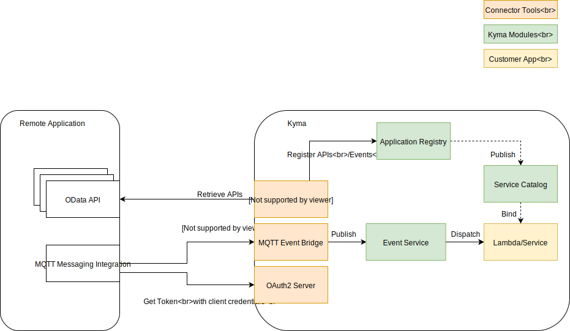

#  Connector Tools

The `Connector-tools` is a `Kyma Bundle` based on the [`Kyma Helm Broker`](https://kyma-project.io/docs/components/helm-broker/) concept.
The bundle will enable an `MQTT enabled services` to be connected with a `Kyma` cluster by activating eventing on base of the MQTT protocol and executing the API registration for specific services.

## Components of the Bundle

|Component|Description|
|---|---|
|MQTT Bridge|Simple nodejs application consumes MQTT messages and tranforms them into a JSON payload and sends them to the Kyma/XF event bus|
|Oauth2 server|In progress|
|Registration App|The registration app does the following: Iterate over a predefined list (ConfigMap) of API endpoints and tries to call the Marketing system for each of these endpoints using the provided basic auth parameters. If there is a valid response from the endpoint then we register the API to the Application in Kyma/XF. Register a static events definition  to the Application in Kyma/XF|

## Input parameters provided by user
|Parameter|Description|
|---|---|
|Hostname|Hostname of the application instance we are registering|
|Basic Auth Username|Username for the Communication User on application. This is the Communication User that must be already created on the application and used for all of the Communication Arrangements (used to expose APIs) we want to register with Kyma/XF|
|Basic Auth Password|Password for the Communication User on the application|
|Application Name|Name of the Application CR that we created for the application system. We use it for the sourceId when sending events to the event bus and when registering the APIs|
